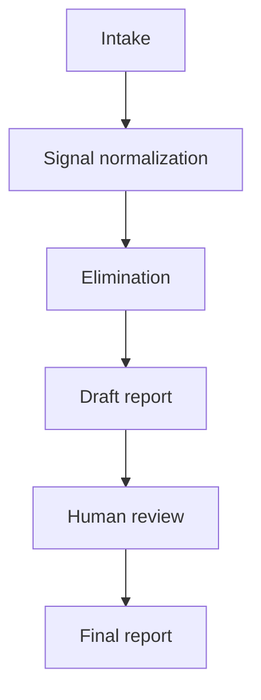

# Workflow (Detailed)

This document expands the decision-support process used in this repository.

> Note: This is a documentation-led method. It is not an executable decision engine.

## Workflow stages

1. **Intake collection**
   - Gather user profile, constraints, and expectations.
   - Capture qualitative preferences across all four diagnostic modules.

2. **Signal normalization**
   - Convert notes into short, consistent qualitative signals.
   - Avoid numerical scoring; keep rationale explicit.

3. **Elimination pass**
   - Apply hard-stop heuristics first.
   - Apply risk flags second.
   - Keep only viable path options.

4. **Draft report preparation**
   - Build a draft recommendation with rationale.
   - Include alternatives and conditions for re-entry.

5. **Human review**
   - Reviewer validates context fit and wording.
   - Recommendation can be confirmed, adjusted, or deferred.

6. **Final report**
   - Publish a final decision-support report.
   - Preserve rationale and status notes for traceability.

## Mermaid flowchart

## Artifacts produced
- Intake record (structured answers by module).
- Signal summary (qualitative, non-scored notes).
- Elimination rationale log (paths removed + why).
- Draft decision report.
- Final reviewed decision report.

## Related files
- Decision logic rules: [`docs/decision-logic.md`](decision-logic.md)
- Diagram source: [`docs/architecture.mmd`](architecture.mmd)
- Example artifacts: [`examples/`](../examples/)
